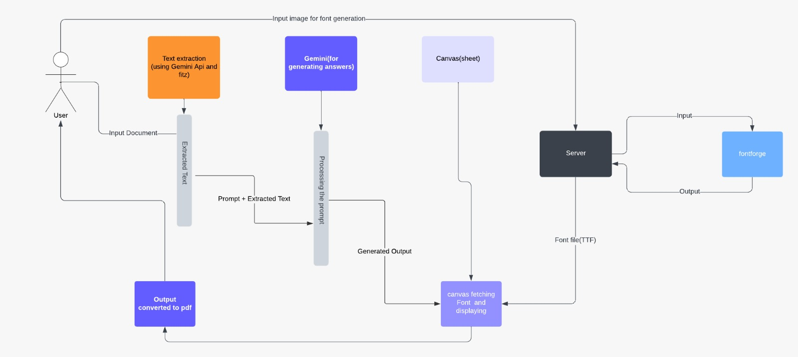

# AssignMe - Complete Your Assignments with Custom Handwriting

AssignMe is an open-source web application that helps students turn digital assignment text into customizable handwritten-style documents. It offers two main capabilities: converting text into handwritten documents, and generating a custom handwriting font from your own writing samples.


## 🛡️ Open Source

This project is open source and released under the [MIT License](./LICENSE). You are free to use, modify, and distribute this software. Contributions are welcome!

## 🌟 Features

### 1. Assignment Text to Handwriting Converter
- Upload assignment questions (PDF or image)
- Enter a subject name to guide processing
- Choose from a wide range of handwriting styles
- Adjust font size, word spacing, letter spacing, and vertical position
- Apply paper effects (shadow, scanner, or clean)
- Pick a pen color (blue, black, red, green)
- Generate and download the result as images or a PDF

### 2. Custom Handwriting Font Generator
- Capture handwriting samples with your camera or upload images
- Generate a TTF font from your samples via the FontForge backend
- Use your generated font in the handwriting converter

### 3. AI-Powered Q&A (Optional Backend)
- Extracts text from uploaded PDFs/images using Google Gemini
- Uses Gemini to draft answers to the assignment questions
- Runs as a separate FastAPI backend service

### 4. FontForge Font Processing Backend (Optional)
- Server-side font generation using FontForge and potrace
- Runs as a Dockerized FastAPI service

## 🖼️ System Architecture



The application is a static front end (HTML/CSS/JS) that runs in the browser. Optional Python backends (Gemini Q&A and FontForge font generation) provide enhanced processing.

## 🚀 Getting Started

You can access the live version of the application at [assignme.live](https://assignme.live), or set up a local environment following the instructions below.

### Prerequisites
- A modern web browser (Chrome, Firefox, Edge recommended)
- An internet connection
- Docker (optional, for the font backend)
- Python 3.8+ (optional, for the AI/backend services)

### Installation
1. Clone the repository:
   ```
   git clone https://github.com/srinathdoggala-tech/Hand-Written-.git
   ```
2. Navigate into the app folder:
   ```
   cd Hand-Written-/Assignment-main
   ```
3. Run the app. It is a static site, so you can either open it directly or serve it:
   - Open `index.html` in your browser, **or**
   - Serve the folder with a simple HTTP server:
     ```
     python -m http.server 8000
     ```
     then visit `http://localhost:8000`.

> **Note:** The front end runs in the browser. The backend services below are optional and provide enhanced functionality (AI processing and font generation).

### Backend Services Setup (Optional)

#### FontForge Backend Service
For custom font generation:

1. Navigate to the FontForge backend directory:
   ```
   cd backend/fontforge
   ```
2. Build and run with Docker:
   ```
   docker build -t assignme-fontforge .
   docker run -p 8000:8000 assignme-fontforge
   ```
3. The service is available at `http://localhost:8000` (endpoint: `POST /generate-font`).

#### Gemini Q&A Service
For AI-powered question processing:

1. Navigate to the Q&A directory:
   ```
   cd "q&a gemini"
   ```
2. Install dependencies:
   ```
   pip install -r requirements.txt
   ```
3. Set your Google Gemini API key as an environment variable (`GEMINI_API_KEY`).
4. Run the service:
   ```
   python main.py
   ```
5. The service is available at `http://localhost:8000` (endpoint: `POST /process-file/`).

## 📚 Usage

### Converting Text to Handwriting
1. Open the home page (`index.html`)
2. Upload your assignment question file (PDF/image)
3. Enter the subject name
4. Click "Upload & Process" to send the file for processing
5. Customize handwriting options (font, size, spacing, color)
6. Optionally upload a custom paper background image
7. Click "Generate Handwritten Sheet" to create your document
8. Download the result as a PDF or individual images

### Creating Your Own Handwriting Font
1. Open the "Own Handwriting" section
2. Follow the capture guidelines (stay in the box, align with the grid, use a black pen)
3. Capture handwriting samples with your camera or upload images
4. Submit the samples to generate a custom font
5. Use your new font in the main handwriting generator

## 🔧 Customization Options

### Handwriting Options
- **Font Selection**: Choose from a large set of handwriting styles
- **Font Size**: Adjust from small to large (up to 30pt)
- **Upload Custom Font**: Add your own TTF/OTF font files
- **Vertical Position**: Adjust text positioning on the page
- **Word Spacing**: Control space between words
- **Letter Spacing**: Adjust space between letters
- **Effects**: Apply shadow, scanner, or no effect
- **Custom Paper Background**: Upload your own paper texture or background image
- **Pen Color**: Choose between blue, black, red, or green ink

## 📂 Project Structure

```
Assignment-main/
│
├── index.html            # Main application page
├── docs.html             # Documentation and guide
├── contactus.html        # Feedback form
├── style.css             # Main stylesheet
├── test.js
├── package.json
├── LICENSE
├── README.md
│
├── canvapage/            # Canvas drawing functionality
│   ├── cypress.json      # Cypress testing configuration
│   ├── images/
│   │   └── dropdown.svg
│   └── js/
│       ├── app.mjs               # Main application script
│       ├── generate-images.mjs   # Image generation functionality
│       └── vendors/
│           └── html2canvas.min.js
│
├── capture-image/        # Custom handwriting capture functionality
│   ├── index.html        # Handwriting capture page
│   ├── scripts.js        # Capture functionality
│   └── style.css         # Capture page styles
│
├── public/               # Static assets
│   ├── css/
│   │   ├── index.css     # Generator/canvas styles
│   │   └── features.css  # Feature-specific styles
│   ├── fonts/            # Handwriting .ttf fonts
│   └── images/           # Site and documentation images
│
├── q&a gemini/           # AI-powered Q&A service (FastAPI)
│   ├── main.py           # Gemini integration (text extraction + answering)
│   └── requirements.txt  # Python dependencies
│
├── backend/
│   └── fontforge/        # FontForge backend service (FastAPI)
│       ├── app.py        # Font generation from uploaded samples
│       └── Dockerfile    # Docker configuration
│
├── script/               # Additional scripts and resources
│   ├── package.json
│   ├── test.js
│   └── images/           # Sample images for font generation
│
└── src/
    ├── js/
    │   ├── config.js     # Front-end configuration
    │   └── script.js     # UI scripts
    ├── tests/
    │   └── generateimage.spec.js
    └── utils/
        ├── draw.mjs              # Drawing functions
        ├── generate-utils.mjs    # Generation utilities
        └── helpers.mjs          # Helper functions
```

## 🏗️ Architecture Overview

### Frontend Components
- **Main Application**: Static HTML/CSS/JS application running in the browser
- **Canvas Page**: Interactive handwriting generation interface
- **Capture Interface**: Handwriting sample collection system

### Backend Services
- **FontForge Backend**: Dockerized Python (FastAPI) service using FontForge and potrace for font generation
- **Gemini Q&A Service**: Python (FastAPI) service using Google's Gemini API for text extraction and answering

### Key Features
- **Client-Side Processing**: Most rendering runs directly in the browser (HTML2Canvas + jsPDF)
- **Optional Backends**: Enhanced capabilities via the FontForge and Gemini services
- **Custom Fonts**: Upload your own TTF/OTF or generate one from samples

## 🔄 API Integration

The application can integrate with backend services for enhanced processing.

### Main File Processing API
The upload flow in `index.html` posts to a hosted processing endpoint:
```javascript
const url = "https://test2-sfwm.onrender.com/process-file/";

function uploadFile() {
  const formData = new FormData();
  formData.append("file", file);
  formData.append("subject", subject);

  axios.post(url, formData, {
    headers: { 'Content-Type': 'multipart/form-data' },
  })
    .then(function (response) {
      // Display the processed response
    })
    .catch(function (error) {
      console.error("Error:", error);
    });
}
```

### FontForge Backend API
Runs locally when the Docker service is started:
```javascript
// Local FontForge backend (Docker)
const fontForgeUrl = "http://localhost:8000/generate-font/";

// POST handwriting sample images to generate a TTF font
```

### Gemini Q&A API
Runs locally when the Gemini service is started:
```javascript
// Local Gemini backend (FastAPI)
const geminiUrl = "http://localhost:8000/process-file/";

// POST a PDF/image with a subject to extract text and draft answers
```

> **Note:** The hosted endpoints above are for testing and demonstration purposes only. For local use, run the backends and point the front end at `localhost`.

## 🐳 Docker Deployment

### FontForge Backend
```bash
# Build the FontForge service
cd backend/fontforge
docker build -t assignme-fontforge .

# Run the service
docker run -d -p 8000:8000 --name fontforge-service assignme-fontforge
```

## 🤖 AI Features

### Gemini Integration
The Q&A Gemini service provides:
- **Text Extraction**: Reads text from uploaded images and PDFs
- **Answer Drafting**: Uses Gemini to answer the extracted assignment questions
- **Subject Context**: Uses the provided subject name to frame the request

### Setup Requirements
1. A Google Gemini API key
2. Python 3.8+
3. Required dependencies (see `q&a gemini/requirements.txt`)

## 🤝 Contributing

Contributions are welcome! Please feel free to submit a Pull Request.

1. Fork the repository
2. Create your feature branch (`git checkout -b feature/amazing-feature`)
3. Commit your changes (`git commit -m 'Add some amazing feature'`)
4. Push to the branch (`git push origin feature/amazing-feature`)
5. Open a Pull Request

### Development Areas
- **Frontend Enhancements**: Improve UI/UX and add new features
- **Backend Services**: Enhance AI processing and font generation
- **API Integration**: Develop new backend service integrations
- **Documentation**: Improve guides and examples

## 📝 License

This project is available under the MIT License. See the LICENSE file for more information.

## 👥 Acknowledgments

- **HTML2Canvas** for converting HTML to images
- **jsPDF** for PDF generation
- **FontForge** and **potrace** for font generation
- **Google Gemini** for AI text extraction and answering
- **FastAPI** and **Docker** for the backend services
- **PyMuPDF** and **Pillow** for document/image handling

## 📧 Contact

Maintained by the AssignMe team. Please open an issue on GitHub for questions or feedback.
